# 🌪️ Natural Language Processing with Disaster Tweets


## 📜 Introduction
This project utilizes Natural Language Processing (NLP) to classify tweets related to natural disasters. It encompasses a comprehensive pipeline, guiding you through fetching data, exploratory data analysis, preprocessing, data checking, segregation, training various models, and testing to evaluate the performance of these models. 

## 📂 Project Overview
The goal is to leverage a solution from the Dataquest.io platform to classify disaster-related tweets using Natural Language Processing (NLP) techniques. The original solution is implemented in a Jupyter Notebook. The primary objective of this project is to transform the developed solution into a data pipeline, utilizing separate .py files for each stage of the machine learning process, thereby ensuring a streamlined workflow. For the effective management of artifacts and execution within the data flow, the Wandb platform is utilized. Furthermore, Apache Airflow is employed to orchestrate the pipeline through Directed Acyclic Graphs (DAGs).

<p align="center">
   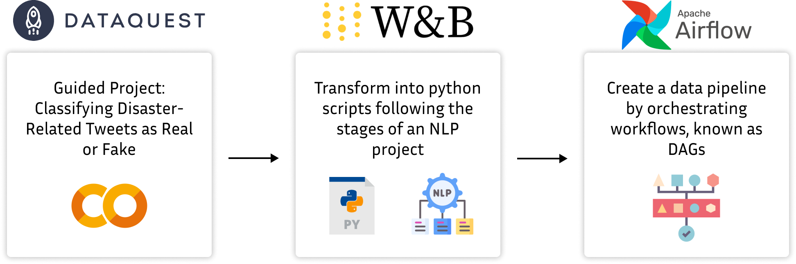
</p>

## 🛠️ Pipeline Execution
The pipeline is designed to run sequentially, with each script in the `src/` directory corresponding to a pipeline step. Also, the DAG is in the main directory. Next, you can view the general structure of the pipeline.

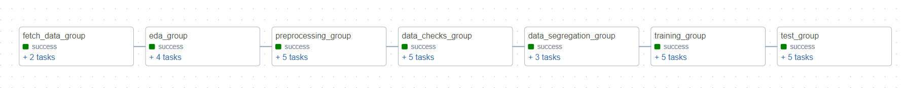

### 1. Data Fetching
The script provides an automated solution for preparing data for an NLP application that analyzes disaster-related tweets. It sets up a logging system for monitoring, downloads the necessary datasets, and organizes them into a specific directory. After downloading, the script uses the Weights & Biases API to track and version the data, ensuring that the entire data preparation process is efficient and reproducible.

<p align="center">
   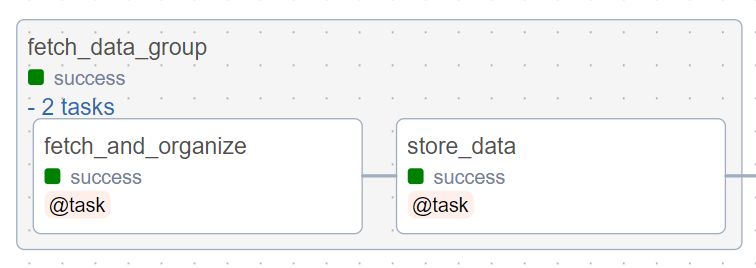
</p>

### 2. Exploratory Data Analysis (EDA)
The script is structured to perform an Exploratory Data Analysis (EDA) on a dataset of disaster-related tweets. It incorporates functions that automate the processes of downloading and loading the dataset, logging dataset information, generating visualizations, and logging the analysis results to Weights & Biases (WandB). 

<p align="center">
   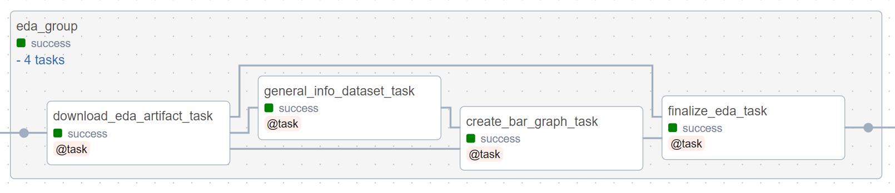
</p>

### 3. Preprocessing
The script is a comprehensive set of functions designed for preprocessing a dataset of tweets related to disasters, suitable for NLP tasks. It begins by initializing a Weights & Biases (WandB) run to download a specific dataset artifact, which is then loaded into a pandas DataFrame. The preprocessing steps include text normalization like converting to lowercase and removing punctuation, tokenization to split text into words, elimination of stopwords, and lemmatization to reduce words to their base forms. The cleaned text is then used to generate word clouds for both disaster and non-disaster tweets, providing a visual exploration of the most frequent terms in each category. Finally, the script creates and logs a new artifact in WandB for the preprocessed data, ensuring that the preprocessing steps are recorded and reproducible.

<p align="center">
   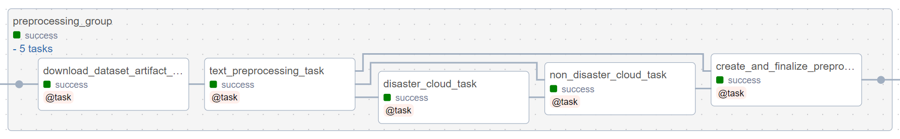
</p>

### 4. Data Check
The script's purpose is to perform data validation checks on a dataset of disaster tweets prior to training models. It implements functions to download the dataset from Weights & Biases, verify the presence and data types of essential columns, and ensure the dataset's size is adequate for training. Specifically, it checks for the 'text' and 'target' columns, validates their data types, and confirms that the dataset contains more than 1000 entries.

<p align="center">
   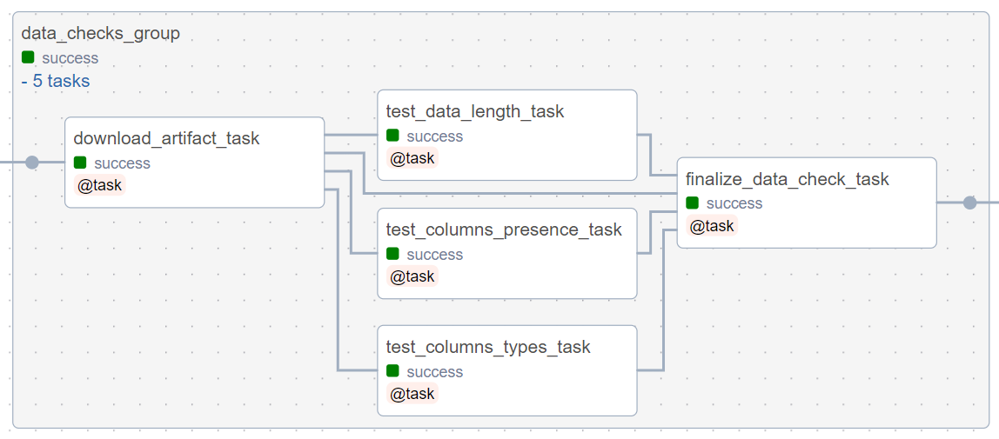
</p>

### 5. Data Segregation
The script's goal is to segregate a preprocessed dataset of disaster-related tweets into training, validation, and test sets. The process begins with downloading the 'processed_data' artifact from Weights & Biases and loading it into a DataFrame. It then continues to separate out the features and labels for the machine learning model.

<p align="center">
   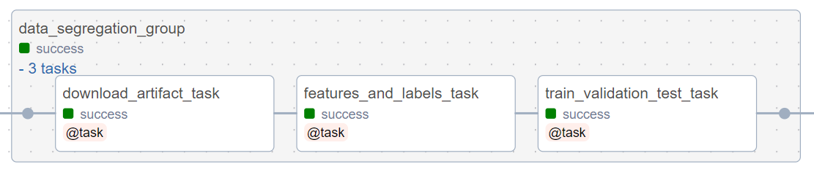
</p>

### 6. Model Training
The script is focused on training four different models on a dataset of disaster-related tweets, demonstrating diverse approaches in machine learning and deep learning. It starts by downloading preprocessed data (features and labels) from Weights & Biases and then moves into the training phase with different neural network architectures:

1. **Model 1 - Shallow Neural Network**: this model uses a simple architecture with an embedding layer and global max pooling, followed by a dense layer. It's a straightforward model, quick to train, and serves as a baseline for comparison with more complex models.

2. **Model 2 - Multi-layer Neural Network**: this model introduces more complexity with multiple dense layers and regularization to prevent overfitting. It includes dropout layers for robustness and is trained using a slower learning rate for more nuanced learning.

3. **Model 3 - Multilayer Bidirectional LSTM**: this model employs LSTM (Long Short-Term Memory) layers in a bidirectional setup to capture sequential patterns in text data more effectively. It's more suitable for understanding the context in language data.

4. **Model 4 - Transformer (DistilBERT)**: the most advanced model in the script, it utilizes a transformer architecture (DistilBERT) for handling sequence data. Transformers are state-of-the-art in NLP, offering significant improvements in understanding the context and nuances of language.

The script not only saves the trained models as artifacts in Weights & Biases for future reference or deployment but also includes a detailed visualization of the training process for each model. It plots graphs depicting the loss and accuracy metrics over the training epochs, providing a clear view of how each model performs during training.

<p align="center">
   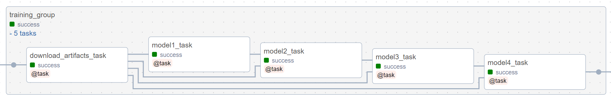
</p>

### 7. Model Testing
The script is designed to test four different models on a dataset of disaster-related tweets. It initializes a run in Weights & Biases (WandB), downloads the test datasets, and then proceeds to evaluate each model. This evaluation includes computing accuracy and loss metrics, generating predictions, and analyzing these predictions through classification reports. Additionally, it visualizes the results using confusion matrices for each model. 

<p align="center">
   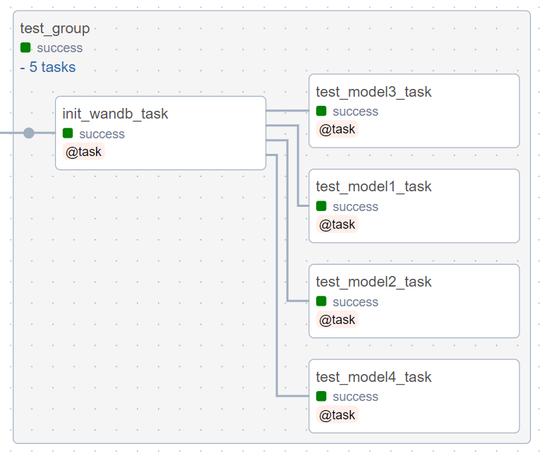
</p>

For a comprehensive view of the pipeline execution stages, artifacts produced, and detailed logs, visit our [Weights & Biases project page](https://wandb.ai/thaisaraujom/disaster_tweet_classification).


## 📊 Model Accuracy Comparison

This section summarizes the training and testing accuracy of the different models evaluated in this project. The comparison allows for a quick assessment of how each model performs and highlights the differences in their predictive capabilities.

| Model                                   | Train Accuracy | Test Accuracy |
|-----------------------------------------|----------------|---------------|
| Model 1: Shallow model                  | 0.99035        | 0.744         |
| Model 2: Multi-layer model              | 0.56753        | 0.574         |
| Model 3: Multi-layer bidirectional LSTM | 0.8633         | 0.787         |
| Model 4: Transformers model             | 0.8590         | 0.83          |

These accuracy figures reflect the models' ability to generalize from the training data to unseen data. Higher test accuracy indicates a model with better generalization.

## 🔢 Confusion Matrices

Below are the confusion matrices for each of the models used in the classification task. These matrices help us understand the performance of each model in terms of true positives, false positives, true negatives, and false negatives. Based on the confusion matrices:

- **Model 2** has the worst performance, with an inability to identify any positive cases.
- **Model 3** improves on Model 2, with some ability to identify positive cases but still with a significant number of false positives.
- **Model 4** seems to be the most effective model, with a better balance between identifying positive and negative cases and fewer errors in both classes.

<table>
<tr>
   <th style="text-align: center;">Model 2</th>
   <th style="text-align: center;">Model 3</th>
</tr>
<tr>
   <td style="text-align: center;">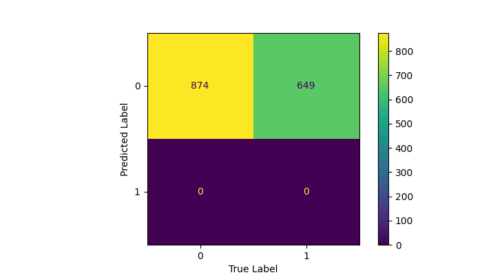</td>
   <td style="text-align: center;">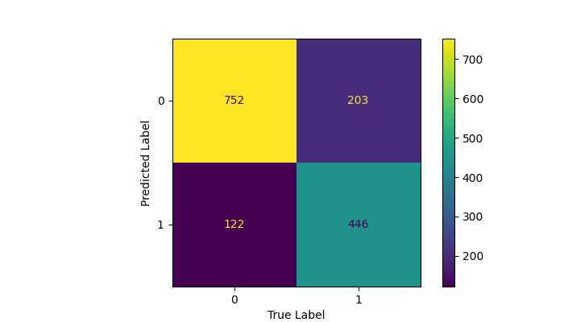</td>
</tr>
<tr>
   <td style="text-align: center;"><strong>Model 4</strong></td>
   <td></td>
</tr>
<tr>
   <td style="text-align: center;"></td>
   <td></td>
</tr>
</table>


## 📈 Loss and Accuracy Plots

These plots show the loss and accuracy metrics during the training process for our models. They are indicative of how well the models learned from the training data over time.

<table>
<tr>
   <th style="text-align: center;">Model 1</th>
   <th style="text-align: center;">Model 2</th>
</tr>
<tr>
   <td>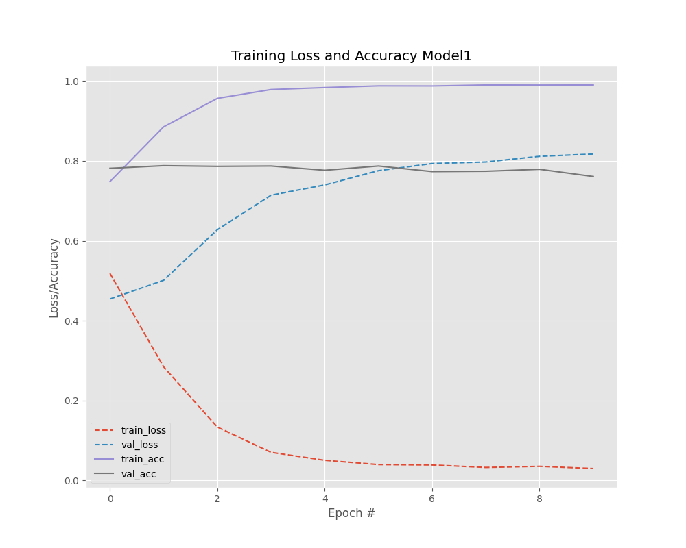</td>
   <td>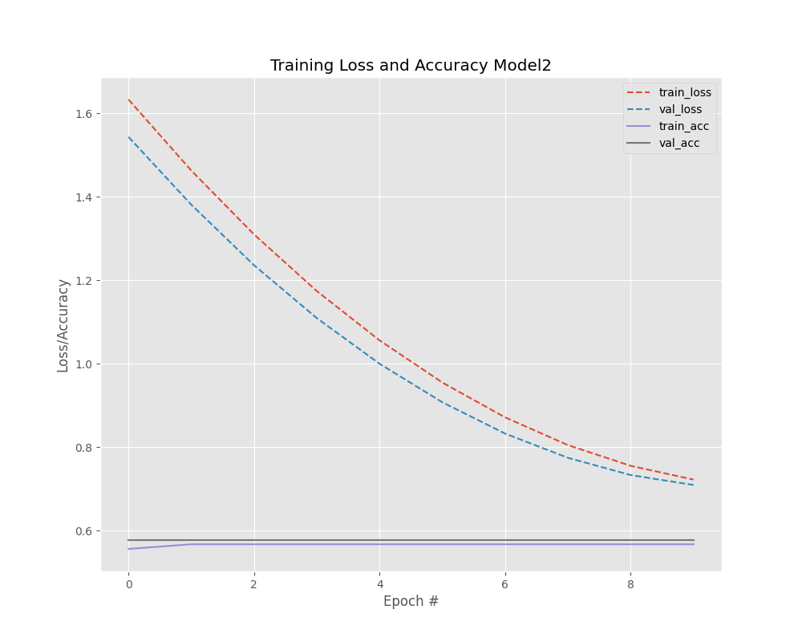</td>
</tr>
<tr>
   <th style="text-align: center;">Model 3</th>
   <th style="text-align: center;">Model 4</th>
</tr>
<tr>
   <td>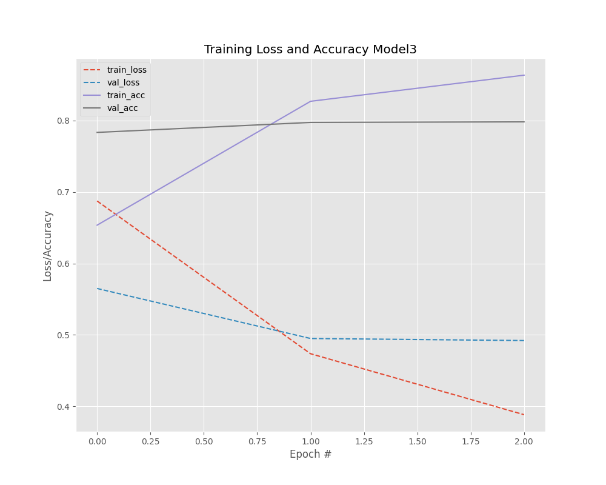</td>
   <td>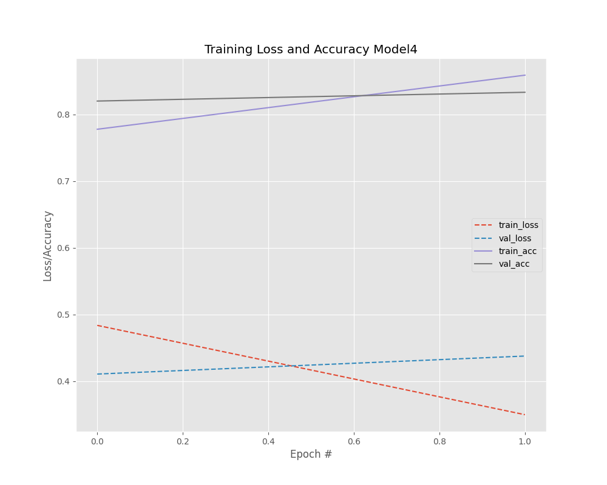</td>
</tr>
</table>


The first graph displays the behavior of Model 1 during training. There is an initial rapid improvement followed by stabilization in both loss and accuracy, suggesting that the model quickly learned the task, but it may be starting to overfit, as indicated by the divergence between training and validation accuracies.

The graph for Model 2 illustrates a steady decrease in both training and validation loss over epochs, which indicates that the model is learning effectively. The convergence of training and validation loss suggests good generalization without significant overfitting. The training and validation accuracy both show an upward trend, further reinforcing the model's ability to generalize well from the training data to unseen data.

The provided graph for Model 3 shows a consistent decrease in training loss, suggesting the model is learning as expected. However, the validation loss decreases to a point and then plateaus, which may imply that further learning is not translating to improved performance on the validation set. On the other hand, the training accuracy improves steadily over time, yet the validation accuracy remains relatively flat. This pattern could indicate that the model is not effectively generalizing beyond the training data.

The graph for the Model 4 transformers displays an interesting pattern, with a very gentle slope in both loss and accuracy. The slow but consistent improvement suggests that the model is learning from the data, but it might need more epochs or a larger dataset to fully utilize its complex architecture. It's also possible that the model's capacity is greater than necessary for the dataset, requiring more sophisticated regularization methods to optimize its performance.

## 🔧 Requirements/Technologies
- **Python Version**: 3.9 or higher. The pipeline is developed and tested with Python 3.9+, ensuring compatibility with the latest language features and libraries.
- **Python Packages**: A comprehensive list of Python packages required for running the pipeline is detailed within the `requirements.txt` file.

## 🚀 Getting Started
To run the pipeline, make sure Apache Airflow is set up and operational. Define the necessary environment variables in the .env file, install dependencies from requirements.txt, and follow these steps:

1. Ensure you have Python version 3.8+ and Airflow 2.3+ installed. You can find instructions on how to install Airflow [here](https://airflow.apache.org/docs/apache-airflow/stable/start.html). Remember to configure the path to the `AIRFLOW_HOME` environment variable and the `airflow.cfg` file as instructed in the documentation to define the Airflow home directory and path to the dags folder.

2. Clone the repository: 
   ```
   git clone https://github.com/thaisaraujom/mlops2023.git
   ```

3. Navigate to the `Disaster_Tweet_Classification` directory.

4. Install the required libraries: 
   ```
   pip install -r requirements.txt
   ``` 

5. Sign up for a Weights & Biases account to obtain your API key for experiment tracking. Visit the [Weights & Biases sign-up page](https://wandb.ai/signup) to create an account. Once you have your account, locate your API key in the account settings.

   To configure the API key on your machine, add it to the `.env` file in your project's root directory:
   ```
   WANDB_API_KEY='your_api_key_here'
   ```
   Make sure to replace `your_api_key_here` with your actual API key. This `.env` file should not be committed to your version control system; ensure it's listed in your `.gitignore` file to prevent potential security issues.

## 🎥 Video Explanation
Explore the project in our [video](https://youtu.be/puVPk2L-vQQ).

## 👥 Team

- [**Mariana Azevedo**](https://github.com/marianabritoazevedo)
- [**Thaís Medeiros**](https://github.com/thaisaraujom)

<!-- ## 🏆 Certificates
Certificates of completion for the following courses:
- [Introduction to Deep Learning in TensorFlow](https://app.dataquest.io/view_cert/I8ZC98T3YA4SJLCIC0AV)
- [Sequence Models for Deep Learning](https://app.dataquest.io/view_cert/XPHLQDP52Y07E1LDZC89)
- [Natural Language Processing for Deep Learning](https://app.dataquest.io/view_cert/HBNUAP6NM58YP0TFAO29) -->

## 📚 References
- [Classifying Disaster-Related Tweets as Real or Fake (Dataquest Project)](https://github.com/dataquestio/solutions/blob/master/Mission797Solutions.ipynb)
